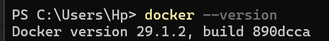

<!-- Commande - Docker info -->
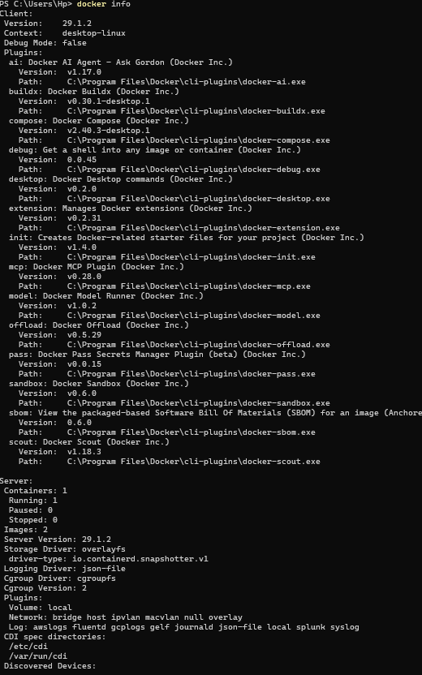

<!-- Commande - Docker ps -->
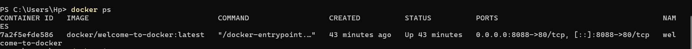

<!-- Commande - Docker images -->
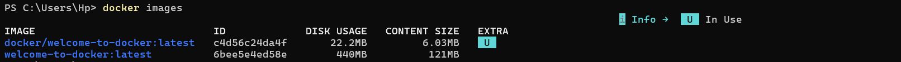

<!-- Commande - Docker Run -->
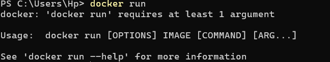

<!-- Commande - Docker Stop -->
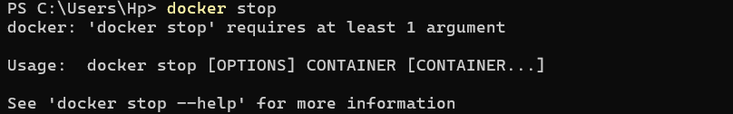

<!-- Commande - Docker pull -->
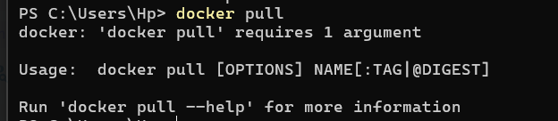

<!-- Commande - Docker images -->
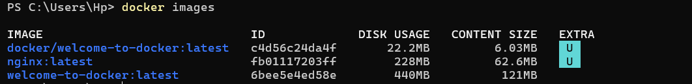

<!-- Commande - Docker run welcome to docker -->
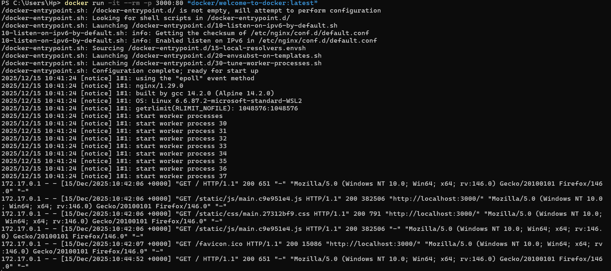

<!-- Commande - Docker stop id (docker stop 7a2f5efde586) -->
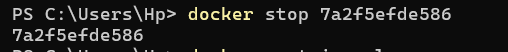

<!-- Commande - Docker Supprimez r (docker rm -f <id conteneur) -->
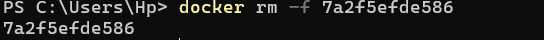

<!-- Commande - Docker Supprimez Image (docker rmi <id conteneur) -->
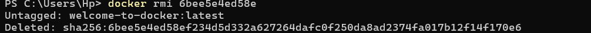

<!-- Supprimer les images  -->
docker rmi $(docker images -a -q)

<!-- Supprimez un conteneur specifique  -->
docker rm nom_ou_id_conteneur

<!-- Supprimez plusieurs connteurs  -->
docker rm conteneur1 conteneur2 conteneur3

<!-- Supprimez tous les containeurs inutilisé -->
docker container  prune

<!-- Supprimez un docker actif  -->
docker rm -f nom_ou_id_conteneur

