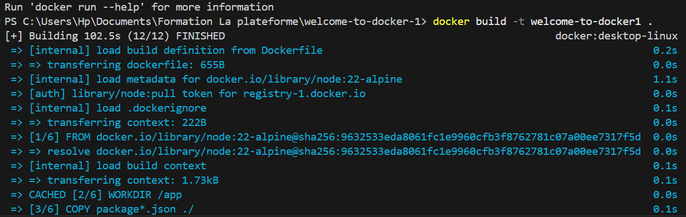
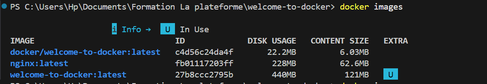
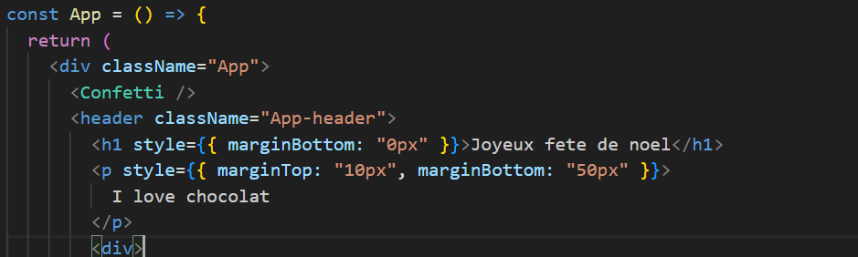
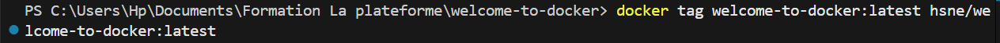
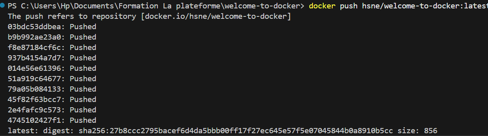
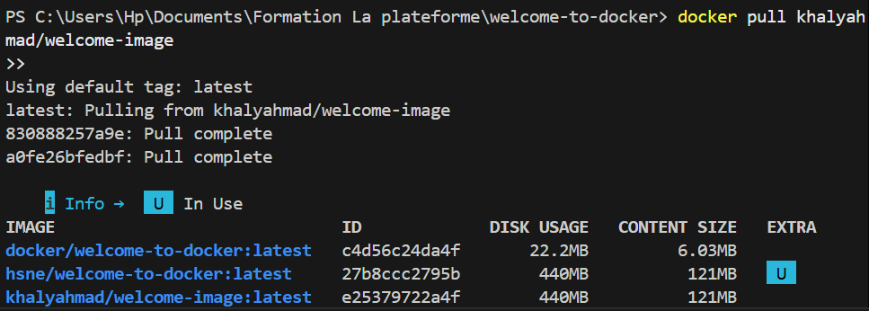
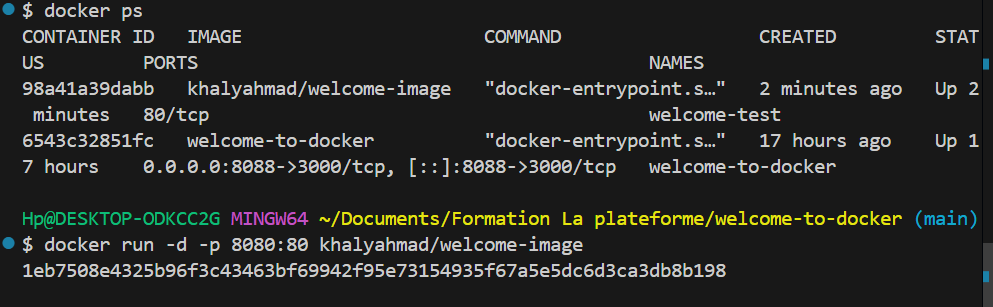

<!-- Commande  Docker build -t nom_du_dossier -->

<!-- Commande pou rlancer l'image  docker run --rm -it 8080:3000  -->

<!-- Editer le app js  -->

docker build -t welcome-to-docker . 
docker run -d -p 8088:3000 --name welcome-to-docker welcome-to-docker

<!-- Nouveau rendu  -->

<!-- Rechercher l'images  -->

<!-- Changez le noms tags de l'image a push  -->

<!-- Voir si le nom de  l'image a bien est bein change  -->

<!-- Push l'image  -->

<!-- Recuperer l'image d'un camarade  -->

<!-- Lancez l'image du camarade -->

<!-- Resultat image camarade  -->
