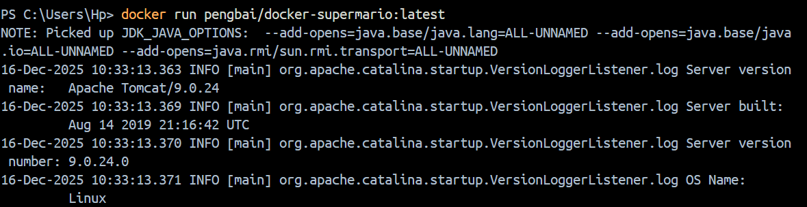
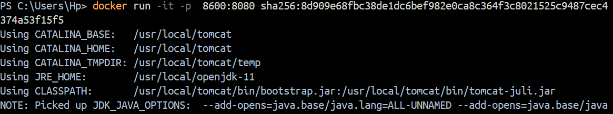
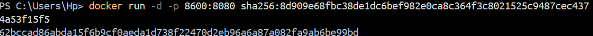
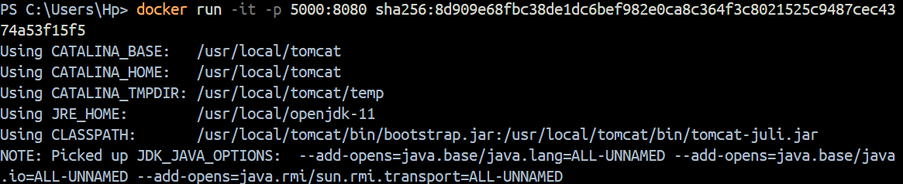
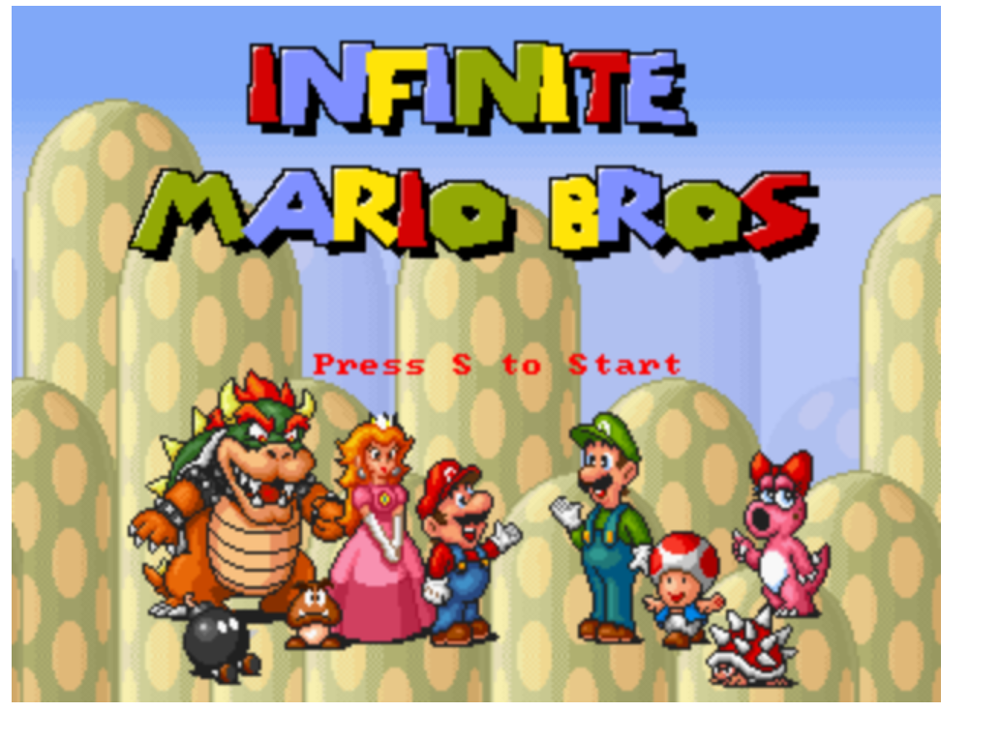
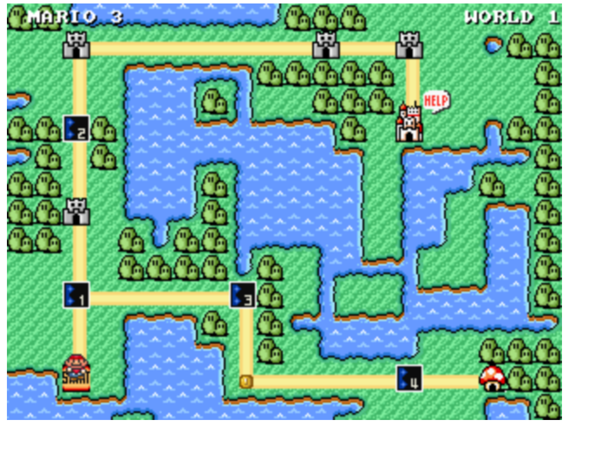
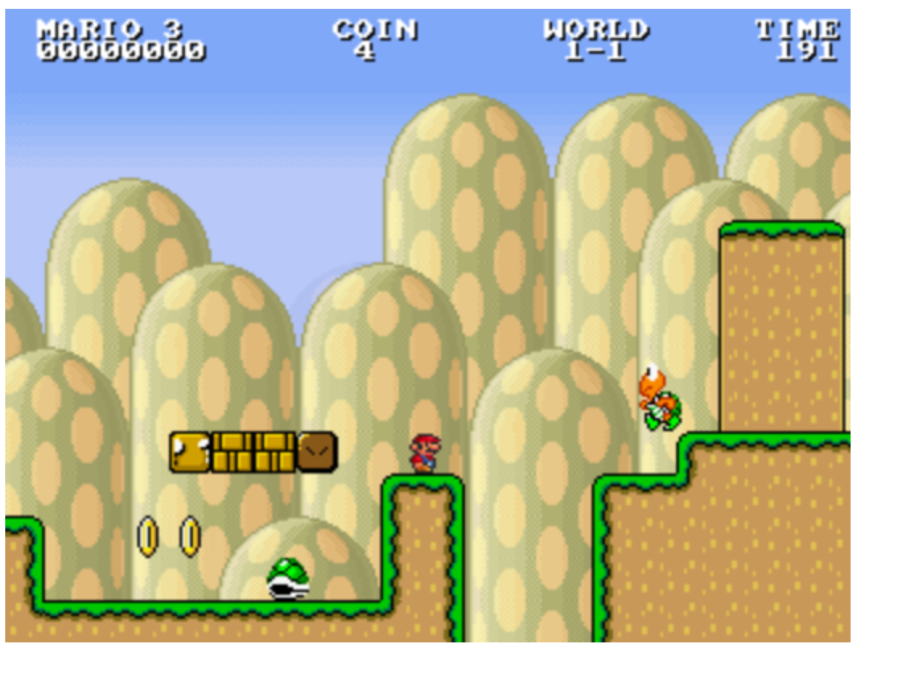
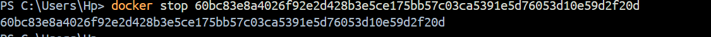
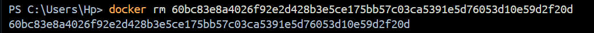
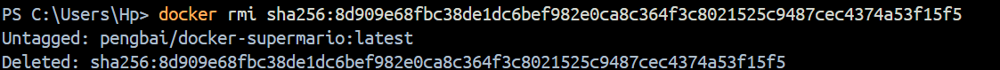

<!-- recueperer l'image depuis docker hub  -->

<!-- Lancez l'image -->

<!-- methode de lancement de l'image dans le port 8600 en arriere plant -->

<!-- methode de lancement de l'image dans le port 8600 en arriere plant  -->

Deuxieme methode et de le lance dans docker dekstop en specifiant le port 

<!-- lancement dans un autre port  -->

<!-- Résultat du jeu  : Mario -->

<!-- Arret du container -->
maniere de trouver l'id allez dans conatiner dans Docker Dekstop et recuperer l'id , ou faire docker ps -a et recuperer l'id.

<!-- Supprimez un container -->

<!-- Supprimez l'image Mario  -->
