# Tic Tac Toe — Docker & Volume
## Étape 1 — Vérifier la version de Docker

Commande utilisée :
```bash
docker version
```

Cette commande affiche la version du client et du serveur Docker installés sur la machine.  
Elle permet de confirmer que Docker est bien installé et opérationnel.

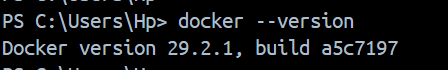

---

## Étape 2 — Informations sur l'environnement Docker

Commande utilisée :
```bash
docker info
```

Affiche les informations globales de l'environnement Docker : nombre de conteneurs, images,  
volumes présents, système d'exploitation, mémoire disponible, etc.

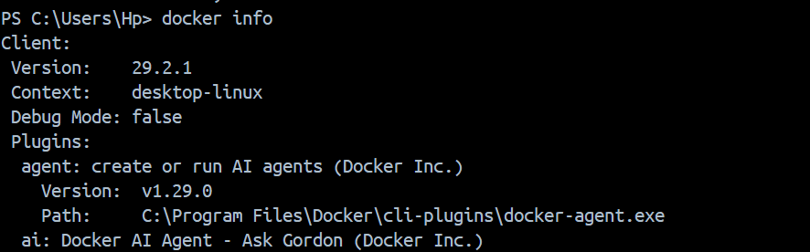

---

## Étape 3 — Créer l'image Docker

Commande utilisée :
```bash
docker build -t mon-jeu .
```

Le `Dockerfile` contient les instructions pour construire l'image :
- on part d'une image PHP + Apache officielle
- on copie les fichiers du jeu dans le conteneur
- on expose le port 80

Le `.` à la fin indique que le `Dockerfile` se trouve dans le dossier courant.

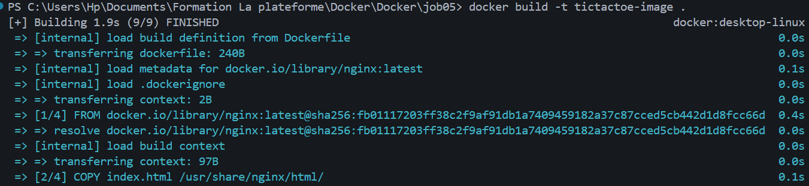

---

## Étape 4 — Afficher les images disponibles

Commande utilisée :
```bash
docker images
```

Liste toutes les images présentes sur la machine.  
On vérifie ici que l'image `mon-jeu` a bien été créée avec sa taille et sa date de création.

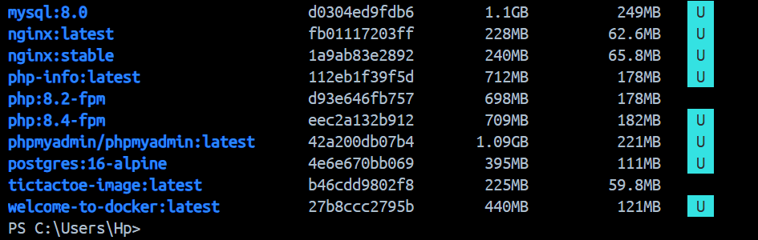

---

## Étape 5 — Créer le volume

Commande utilisée :
```bash
docker volume create game-results
```

Un volume est un espace de stockage **extérieur au conteneur**.  
Les données qui y sont écrites survivent même si le conteneur est stoppé ou supprimé.  
Ici, le volume `game-results` va stocker le fichier `results.json`.

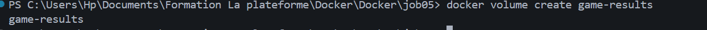

---

## Étape 6 — Vérifier que le volume existe

Commande utilisée :
```bash
docker volume ls
```

Liste tous les volumes présents sur la machine.  
On confirme que `game-results` apparaît bien dans la liste.

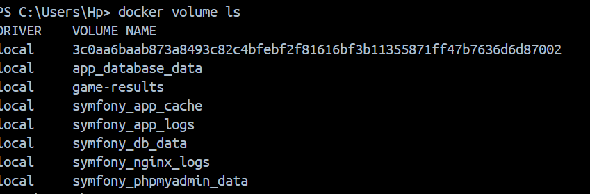

---

## Étape 7 — Lancer le conteneur

Commande utilisée :
```bash
docker run -d -p 8080:80 --name tictactoe -v game-results:/var/www/html mon-jeu
```

|---|---|
| `-d` | Lance le conteneur en arrière-plan |
| `-p 8080:80` | Redirige le port 8080 de la machine vers le port 80 du conteneur |
| `--name tictactoe` | Donne un nom au conteneur |
| `-v game-results:/var/www/html` | Lie le volume au dossier des fichiers du jeu |

Le jeu est maintenant accessible sur : **http://localhost:8080**

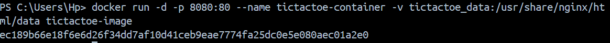

---

## Étape 8 — Jouer plusieurs parties

Le jeu est accessible via le navigateur sur `http://localhost:8080`.  
À chaque fin de partie, le JavaScript envoie le résultat à `save.php` via une requête POST.  
`save.php` ajoute l'entrée dans `results.json`.

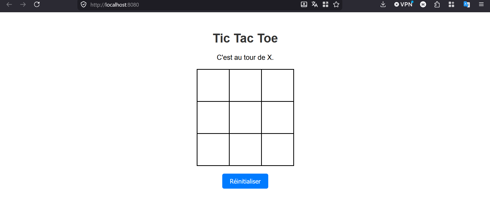

---

## Étape 10 — Afficher le contenu de results.json

**Dans le terminal :**
```bash
docker exec tictactoe cat /var/www/html/results.json
```
On vérifie que les résultats des parties ont bien été enregistrés dans le fichier.

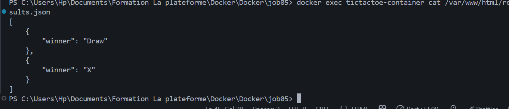

---

## Étape 11 — Inspecter le volume

Commande utilisée :
```bash
docker volume inspect game-results
```

Affiche les détails du volume : son nom, son emplacement réel sur le disque (`Mountpoint`),  
la date de création. C'est à cette adresse que Docker stocke physiquement les données.

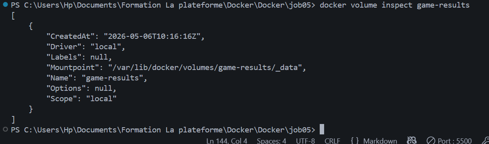

---

## Étape 12 — Stopper le conteneur

Commande utilisée :
```bash
docker stop tictactoe-container
```

Arrête le conteneur. Les données dans le volume `game-results` sont conservées.

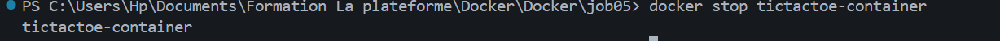

---

## Étape 13 — Vérifier la persistance

On relance un nouveau conteneur en utilisant le même volume :

```bash
docker run -d -p 8080:80 --name tictactoe-container2 -v game-results:/var/www/html tictactoe-image
```

Puis on relit `results.json` :

```bash
docker exec tictactoe-container2 cat /var/www/html/results.json
```

Les résultats des parties précédentes sont toujours présents.  
C'est la preuve que le volume a bien rendu les données **persistantes** indépendamment du conteneur.


---

## Récapitulatif des commandes

```bash
# Construire l'image
docker build -t mon-jeu .

# Créer le volume
docker volume create game-results

# Lancer le conteneur avec le volume
docker run -d -p 8080:80 --name tictactoe -v game-results:/var/www/html mon-jeu

# Vérifier les images
docker images

# Vérifier les volumes
docker volume ls

# Inspecter un volume
docker volume inspect game-results

# Lister les fichiers dans le conteneur
docker exec tictactoe ls /var/www/html

# Lire results.json
docker exec tictactoe cat /var/www/html/results.json

# Stopper le conteneur
docker stop tictactoe
```